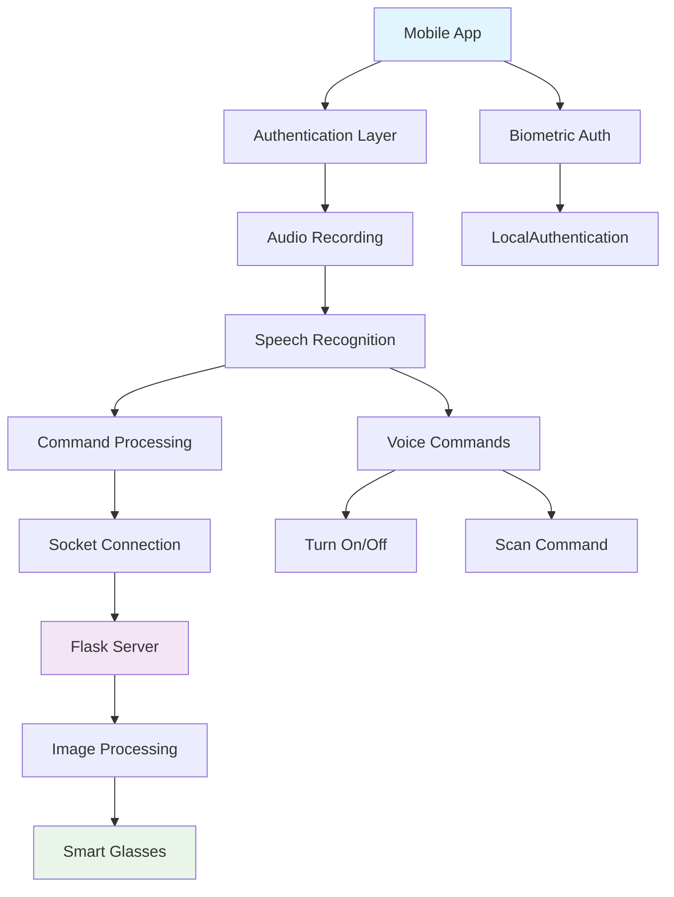
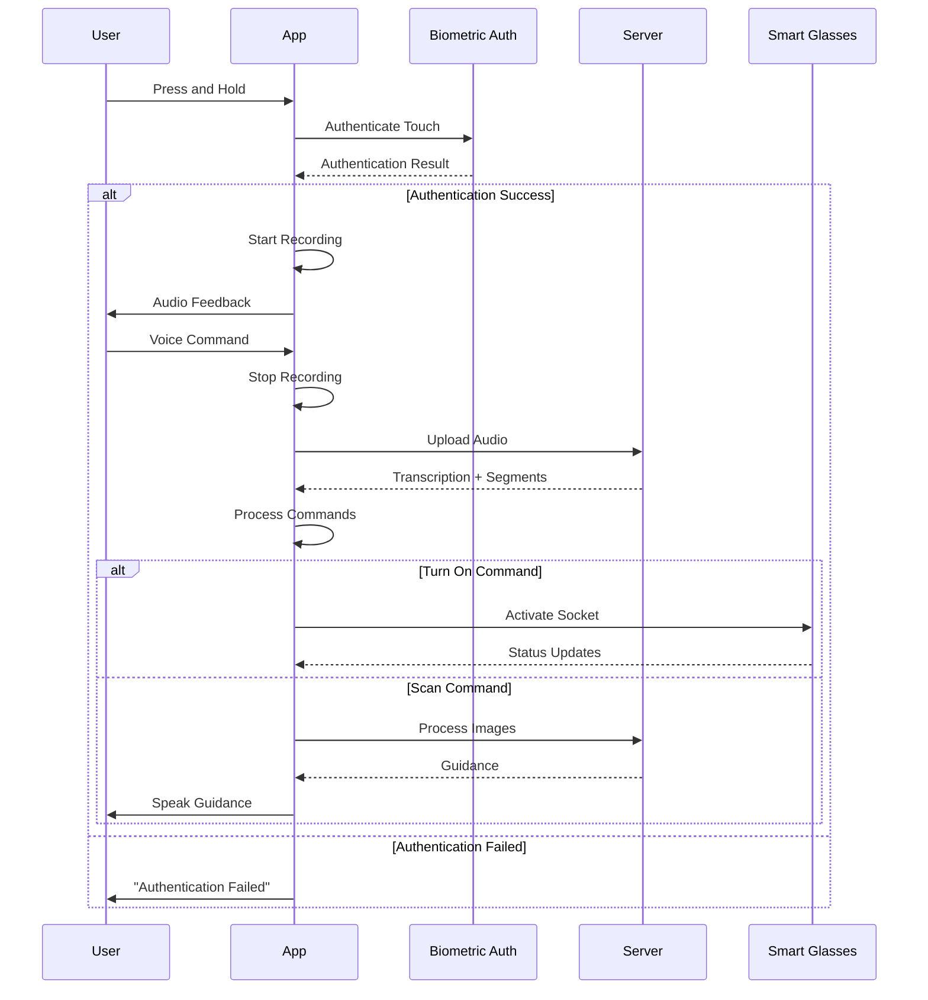
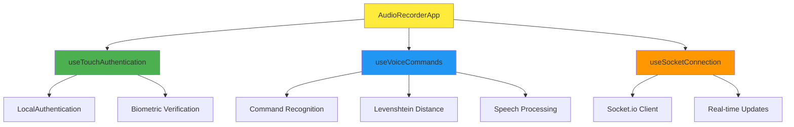
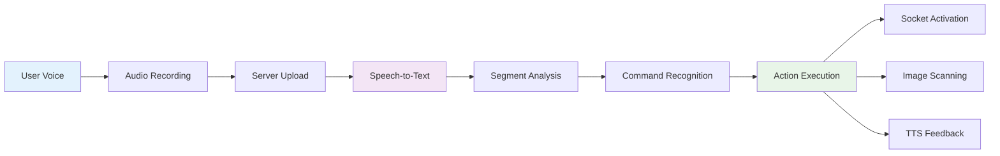

# 🎤 Smart Glasses Audio Recording App

<div align="center">
  
  
  
  
  
  
  **An intelligent voice-controlled smart glasses companion app with biometric authentication**
  
  Made with ❤️ by Saoud Yahya and Ilyass Otmani
  
</div>

## 🌟 Features

- **🔒 Biometric Authentication**: Touch/fingerprint verification for secure recording
- **🎙️ Voice Commands**: Control smart glasses with voice commands
- **📡 Real-time Socket Connection**: Live communication with backend services
- **🔊 Text-to-Speech Feedback**: Audio feedback for all interactions
- **📱 Cross-platform**: Works on iOS and Android
- **🎯 Smart Recognition**: Fuzzy matching for voice command recognition
- **📸 Image Scanning**: Process and analyze images with voice guidance

## 🏗️ Architecture



## 📱 App Flow



## 🔧 Voice Commands

| Command | Variations | Action |
|---------|------------|--------|
| **Turn On** | "turn on", "turnon", "turon", "turnningon" | Activates smart glasses |
| **Turn Off** | "turn off", "turnoff", "turonoff", "turnningoff" | Deactivates smart glasses |
| **Scan** | "scan", "scun", "skan", "scarn", "scanning" | Initiates image scanning |

## 📦 Installation

### Prerequisites

- Node.js (v16 or higher)
- Expo CLI
- iOS Simulator or Android Emulator
- Physical device for biometric testing

### Setup

1. **Clone the repository**
   ```bash
   git clone <your-repo-url>
   cd MyReactNativeApp2
   ```

2. **Install dependencies**
   ```bash
   npm install
   # or
   yarn install
   ```

3. **Configure environment**
   ```javascript
   // Update CONFIG in App.tsx
   const CONFIG = {
     FLASK_SERVER_URL: 'your-flask-server-url',
     SOCKET_URL: 'your-socket-server-url',
     TOUCH_HOLD_DURATION: 1000,
     MAX_AUTHENTICATION_ATTEMPTS: 3,
   };
   ```

4. **Start the development server**
   ```bash
   expo start
   ```

## 🛠️ Tech Stack

### Frontend
- **React Native** - Cross-platform mobile development
- **TypeScript** - Type-safe development
- **Expo** - Development platform and toolchain

### Core Libraries
- **expo-av** - Audio recording and playback
- **expo-speech** - Text-to-speech functionality
- **expo-local-authentication** - Biometric authentication
- **socket.io-client** - Real-time communication

### Backend Integration
- **Flask Server** - Audio processing and transcription
- **Socket.io Server** - Real-time status updates

## 📋 Component Structure



## 🔐 Security Features

- **Biometric Authentication**: Fingerprint/Face ID verification
- **Attempt Limiting**: Maximum 3 authentication attempts
- **Auto-lock**: Temporary lockout after failed attempts
- **Secure Audio Transmission**: Encrypted server communication

## 🎨 UI/UX Features

- **Adaptive Design**: Responsive to different screen sizes
- **Visual Feedback**: Recording status indicators
- **Haptic Feedback**: Vibration on successful authentication
- **Accessibility**: Voice guidance for visually impaired users

## 📊 Data Flow



## 🔧 Configuration

### Audio Settings
```javascript
const audioConfig = {
  allowsRecordingIOS: true,
  playsInSilentModeIOS: true,
  quality: Audio.RecordingOptionsPresets.HIGH_QUALITY
};
```

### Authentication Settings
```javascript
const authConfig = {
  promptMessage: 'Verify touch to start recording',
  fallbackLabel: 'Use passcode',
  cancelLabel: 'Cancel'
};
```

## 🧪 Testing

### Unit Testing
- Authentication flow testing
- Voice command recognition accuracy
- Socket connection reliability

### Integration Testing  
- End-to-end recording workflow
- Server communication testing
- Biometric authentication scenarios

## 📱 Platform Support

| Platform | Status | Notes |
|----------|--------|-------|
| **iOS** | ✅ | Full biometric support |
| **Android** | ✅ | Fingerprint authentication |
| **Web** | ⚠️ | Limited functionality |

## 🚀 Deployment

### Production Build
```bash
# iOS
expo build:ios

# Android  
expo build:android
```

### Distribution
- **App Store** (iOS)
- **Google Play Store** (Android)
- **Enterprise Distribution**

## 🔍 Troubleshooting

### Common Issues

1. **Authentication Failed**
   - Ensure device has biometric setup
   - Check permissions in device settings

2. **Recording Not Starting**
   - Verify microphone permissions
   - Check audio mode configuration

3. **Socket Connection Issues**
   - Verify server URLs in CONFIG
   - Check network connectivity

## 📈 Performance Optimization

- **Memory Management**: Automatic audio cleanup
- **Battery Optimization**: Efficient socket connections
- **Network Efficiency**: Compressed audio uploads

## 🤝 Contributing

We welcome contributions! Please follow these steps:

1. Fork the repository
2. Create a feature branch
3. Make your changes
4. Add tests if applicable
5. Submit a pull request

## 📄 License

This project is licensed under the 0BSD License - see the LICENSE file for details.

## 👥 Authors

- **Saoud Yahya** - *Lead Developer*
- **Ilyass Otmani** - *Co-Developer*


---
